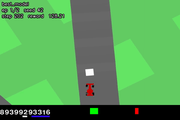
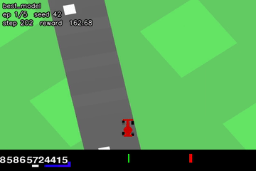
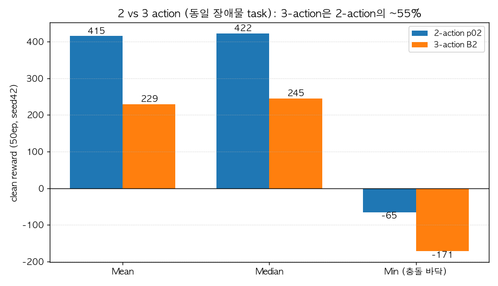

# AICarRacing — 2-Action PPO (팀 B)

Gymnasium **CarRacing-v3** 환경에서 픽셀 입력만으로 주행하는 **2-action PPO** 에이전트.
붕괴된 학습 라인 **복구** → **무작위 정적 장애물 회피** 확장 → **2-action vs native 3-action** 행동 파라미터화 대조 실험까지 다룬다.

> 전체 기술 보고서(환경·State·Reward 정의, PPO 이론, 코드 설명, 결과·고찰)는 **[`COMBINED_REPORT.pdf`](COMBINED_REPORT.pdf)** 참조.

---

## 핵심 결과

| 모델 | 과제 | clean 보상 (Mean / Median) | 비고 |
|---|---|---|---|
| **2-action 베이스** | 무장애물 트랙 | **667 / 745** | 붕괴(−17) → 복구·스케일업 (9.8M) |
| **2-action 장애물** | 장애물 회피 | **415 / 422** | 최종 채택 (corner penalty 0.2) |
| 3-action 장애물 (대조군) | 장애물 회피 | 229 / 245 | 2-action의 ~55% (구조적 불리) |

- **붕괴 복구**: per-minibatch KL early-stop + env-step 코사인 LR + 죽은 속도 보상 수정 → clean **667** 달성.
- **장애물 회피 학습** (동일 시드 before→after): seed42 **−68 → +323**, seed43 **237 → 707**.
- **2 vs 3 action**: 동일 task·하이퍼파라미터에서 native 3-action은 entropy(std) 발산 → 공정 재튜닝(ent 0.003) 후에도 clean 229로 2-action(415)의 **~55%**. ActionWrapper의 signed-throttle이 유용한 inductive bias임을 확인.

### 장애물 학습 전 → 후 (seed 42, 동일 트랙)

| Before (학습 전, 누적 −68) | After (학습 후, 누적 +323) |
|:--:|:--:|
|  |  |
| 흰 장애물로 정면 충돌 | 도로 위에서 회피 주행 |

### 2 vs 3 action 비교



---

## 설치

```bash
git clone https://github.com/STkangyh/AICarRacing.git
cd AICarRacing
pip install -r requirements.txt
```

- **Python 3.11**, **torch ≥ 2.6**(체크포인트 `weights_only=False` 로드), gymnasium 1.3.0, box2d-py, pygame, **opencv-python**(필수 — grayscale 변환), numpy, tensorboard, matplotlib, imageio(+ffmpeg, 녹화용).
- 정확한 버전·docker image 추가 설치 명령은 [`COMBINED_REPORT.pdf`](COMBINED_REPORT.pdf) **§0** 참조.
- 학습은 GPU(A100) 권장, 평가/녹화는 CPU로도 가능.

## 실행

모든 스크립트는 저장소 루트에서 **모듈 방식**(`python -m scripts.NAME`)으로 실행한다.

```bash
# --- 학습 ---
python -m scripts.train_ppo_2action2 --steps 6000000                                   # 2-action 베이스
python -m scripts.train_ppo_2action_obstacles --accel-turn-weight 0.2 \
        --obstacle-size-min 0.25 --obstacle-size-max 0.6                               # 장애물 회피
python -m scripts.train_ppo_3action_obstacles --ent-coef 0.003 \
        --obstacle-size-min 0.25 --obstacle-size-max 0.6                               # 3-action 대조군

# --- 평가 (clean) ---
python -m scripts.evaluate_agent_2action --model ./models/ppo_2action4/best_model.pth --episodes 100 --seed 42
python -m scripts.evaluate_agent_2action_obstacles --model ./models/obs_small/best_model.pth \
        --obstacle-size-min 0.25 --obstacle-size-max 0.6 --episodes 50 --seed 42

# --- 영상 녹화 (mp4) ---
python scripts/record_video.py --model ./models/ppo_2action4/best_model.pth --episodes 5

# --- TensorBoard ---
tensorboard --logdir=logs
```

> 체크포인트는 `.gitignore`(`/models`)로 git에 포함되지 않는다. 평가용 모델은 제출 번들/별도 전달로 받거나 위 학습 커맨드로 재현한다. 저장소에 포함된 3-action 참고 가중치는 `BestSavedAgents/evaluated641.pth`.

## 프로젝트 구조

```
src/
  car_racing_obstacles.py   # CarRacingObstacles-v0 (랜덤 정적 장애물, 픽셀 렌더, segfault-safe)
  ppo_agent_2.py            # 2-action PPO (per-minibatch KL early-stop + env-step 코사인 LR)
  ppo_agent.py              # 원본 3-action PPO
  cnn_model.py              # CNN 특징 추출기 (4×96×96 → 256)
  env_wrappers.py           # GrayScale / FrameStack / TimeLimit / ActionWrapper(2D→3D)
  rollout_buffer.py
scripts/
  train_ppo_2action2.py            # 베이스 학습
  train_ppo_2action_obstacles.py   # 장애물 회피 학습
  train_ppo_3action_obstacles.py   # 3-action 대조군
  evaluate_agent_2action.py        # 베이스 평가
  evaluate_agent_2action_obstacles.py  # 장애물 평가
  evaluate_agent_3action_obstacles.py  # 3-action 장애물 평가
  record_video.py                  # 평가 리플레이 → mp4
  dump_tb_scalars.py / make_report_figs.py / build_combined_report.py  # 보고서 도구
REPORT.md / REPORT_obstacles.md / COMBINED_REPORT.{md,pdf,docx}        # 보고서
report_assets/                     # 그림 · 주행 프레임 · GIF
requirements.txt
```

## 환경 정의 (요약)

- **State**: 96×96 `state_pixels` → grayscale → 4프레임 스택 → `(4, 96, 96)`, `/255` 정규화. 장애물은 관측에 **흰색(255)** 으로 그려 픽셀 에이전트가 인지 가능.
- **Action**: 2-action `[steering, throttle]`(ActionWrapper가 throttle>0→gas, <0→brake로 매핑) vs native 3-action `[steering, gas, brake]`.
- **Reward**: 네이티브(프레임당 −0.1, 타일 통과 +1000/N, 이탈 −100) + 장애물 충돌 −15(penalty-only) + 학습용 shaping(velocity `speed×0.003`, off-track penalty, steering-smooth, corner accel). 평가는 shaping 제거한 **clean reward**.
- 상세는 [`COMBINED_REPORT.pdf`](COMBINED_REPORT.pdf) §1.

## 크레딧

원본 CarRacing PPO 베이스(3-action, `BestSavedAgents/`의 `evaluated641`/`Evaluated679`) 위에 팀 B가 2-action 복구·장애물 환경·3-action 대조 실험과 보고서를 추가했다. 환경: [Gymnasium CarRacing](https://gymnasium.farama.org/environments/box2d/car_racing/).
