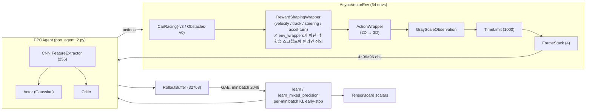

# AICarRacing 기술 보고서 — 2-Action PPO 에이전트의 붕괴 복구, 장애물 회피 확장, 그리고 코너 감속 개선 (round-2 미학습) (팀 B)

## 1. 개요 / 목표

본 프로젝트(**AICarRacing**)는 Gymnasium `CarRacing-v3` 환경을 대상으로 한 **2-action PPO(Proximal Policy Optimization) 에이전트**를 개발·복구·확장한 작업이다. 진행 흐름은 다음 네 단계로 요약된다.

1. **원래 목표** — 평가(evaluation) 시 최고 성능 모델의 주행 영상을 녹화하는 스크립트(`scripts/record_video.py`)를 구축한다.
2. **붕괴 복구** — 다운로드한 기존 2-action 학습 라인(`models/ppo_2action2`)이 PPO 붕괴(collapse)로 망가져 있음을 진단하고, 3개의 독립적인 버그를 수정하여 정상 학습 곡선을 복원한다.
3. **성능 확장** — 복구된 모델을 6M → 20M 스텝으로 스케일업하여 기존 3-action 베이스라인을 능가하는 모델을 확보한다.
4. **태스크 확장 + 개선** — 무작위 정적 장애물 회피 태스크(`CarRacingObstacles-v0`)를 신설해 파인튜닝하고(완료), 마지막으로 코너에서의 가속 억제(corner-deceleration) 보상 항을 구현한다(**구현 완료·학습 미수행**).

**달성 요약**: 붕괴된 모델(임베디드 shaped mean_reward **-17.06**)을 복구하여, 최종 베이스 모델(`ppo_2action4/best_model.pth`, global_step **9.83M**, shaped **837.99**)이 clean 평가에서 평균 **667.49**를 기록했다. 이 수치는 3-action 저장 모델의 **임베디드 shaped** 값(`BestSavedAgents/evaluated641.pth` **674.55**, `BestSavedAgents/Evaluated679.pth` **637.95** — 저장 시점의 임베디드 mean이며 clean 평가가 아님)과 동급 이상이다. 추가로 장애물 회피 에이전트(clean obstacle 평가 평균 **330.99**)를 학습시켜 동일 시드 기준 before/after에서 명확한 개선(seed42: -68 → +323, seed43: 237 → 707)을 확인했다. (4단계의 코너 감속 보상은 구현·검증만 완료되었고 round-2 학습은 미수행이므로, 위 모든 결과 수치는 **accel-turn 패널티가 비활성(weight=0.0)** 상태에서 산출된 라운드-1 결과다.)

---

## 2. 시스템 구성

### 2.1 환경 (Environment)

- **기본 환경**: Gymnasium `CarRacing-v3`, 연속 제어(`continuous=True`), `domain_randomize=False`. (이하 학습/파인튜닝의 출발점이 되는 "주행 베이스라인 모델"과 구분하기 위해, 환경 자체는 "**기본 환경**"으로 표기한다.)
- **에이전트 관측(observation)**: `reset()`/`step()`이 `self._render("state_pixels")`로 생성하는 **96×96** 프레임을 grayscale 변환 후 4장 스택한 것 (`frame_stack=4`). 즉 정책이 실제로 보는 입력은 **96×96 grayscale ×4**이다.
- **`rgb_array` 렌더 해상도**: 영상 녹화/사람용 뷰의 `env.render()` 출력은 **400×600×3, render_fps=50**이다(본 보고서 작성 시 `racing` 환경에서 `env.render().shape`로 경험적으로 확인). 이는 에이전트 관측(96×96 `state_pixels`)과는 별개의 디스플레이용 프레임이며, 정책 입력에는 사용되지 않는다.
- **에피소드 길이**: `max_episode_steps=1000` (CarRacing-v3 내장 TimeLimit와 동일).

### 2.2 2-action vs 3-action 과 ActionWrapper

| 좌표계 | 차원 | 성분 | 위치 / 변환 |
|---|---|---|---|
| **정책 출력 (2-action)** | 2D | `[steering, throttle]` | `Actor.fc_mean`의 출력. 본 보고서의 모든 학습/평가 라인이 이것(`action_dim=2`) |
| **ActionWrapper 변환 후 (네이티브 3D)** | 3D | `[steering, gas, brake]` | `ActionWrapper`가 매핑: `throttle>0 → gas`, `throttle<0 → brake` |
| **RewardShapingWrapper 내부에서 보는 action** | 3D | `[steering, gas, brake]` | 셰이핑 래퍼는 `ActionWrapper` **안쪽**에 위치하므로 이미 3D를 받는다. 따라서 래퍼 코드의 `action[0]=steer`, `action[1]=gas` (§6.3 참조) |
| **3-action (비교군)** | 3D | `[steering, gas, brake]` | 네이티브 출력, 변환 없음 |

`Actor`의 출력 차원은 `action_dim = action_space.shape[0]`로 결정되며(2 또는 3), 본 보고서의 모든 학습/평가 라인은 2-action(`action_dim=2`)이다. **좌표계 전환 지점**은 위 표 1행(정책 2D 출력) → 2행(`ActionWrapper` 통과 후 3D)이고, 보상 셰이핑 래퍼는 그 3D를 받는다(§6.3에서 역참조).

### 2.3 에이전트 아키텍처 (CNN / Actor / Critic)

입력은 4채널 96×96 grayscale. CNN 특징 추출기(`src/cnn_model.py`)의 정확한 구조는 다음과 같다.

```
Input (4, 96, 96), 정규화: obs / 255.0
  → Conv2d( 4→16, k=8, s=4) → ReLU → Dropout2d(0.1)
  → Conv2d(16→32, k=4, s=2) → ReLU → Dropout2d(0.1)
  → Conv2d(32→64, k=3, s=1) → ReLU → Dropout2d(0.1)
  → Flatten
  → Linear(n_flatten → features_dim) → Dropout(0.2) → ReLU
가중치 초기화: Conv/Linear 모두 Kaiming Normal (fan_out, ReLU)
```

- **Actor** (Gaussian): `fc1: Linear(features_dim→256) → fc2: Linear(256→256) → fc_mean: Linear(256→action_dim)`. `fc_mean`은 orthogonal 초기화(gain 0.01, bias 0.0). `hidden_dim=256`. (즉 `fc1`의 입력 차원은 하드코딩 256이 아니라 설정값 `features_dim`이며, 본 학습에서 `features_dim=256`이라 결과적으로 256→256이 된다.)
- **Critic**: `fc1: Linear(features_dim→256) → fc2: Linear(256→256) → fc_value: Linear(256→1)`. `hidden_dim=256`.
- `features_dim`의 출처가 두 가지로 갈리므로 명확히 구분한다: **`CNNFeatureExtractor` 생성자의 기본값은 256**이고 실제 학습에서도 256을 사용한다. 한편 학습 스크립트가 config 딕셔너리에서 키를 읽을 때의 **폴백(키 부재 시 기본값)은 64**다(`ppo_agent_2.py`/`ppo_agent.py`에서 `config.get("features_dim", 64)`). 본 학습 config에는 `features_dim=256`이 명시되어 있어 폴백 64는 실제로 사용되지 않는다.

### 2.4 벡터화 PPO 파이프라인



- **래퍼 순서**(내부→외부): `RewardShapingWrapper` → `ActionWrapper` → `GrayScaleObservation` → `TimeLimit(1000)` → `FrameStack(4)`. (즉 보상 셰이핑 래퍼는 ActionWrapper **안쪽**에 위치하므로, 그 내부에서 받는 `action`은 3D `[steer, gas, brake]`이다.)
- **`RewardShapingWrapper`의 위치(중요)**: 이 래퍼는 `src/env_wrappers.py`에 **존재하지 않으며**(grep 0건 확인), 각 학습 스크립트 안에 **인라인 정의**되어 있다 — 베이스용은 `scripts/train_ppo_2action2.py`(line 114~), 장애물용은 `scripts/train_ppo_2action_obstacles.py`(line 121~). **두 사본이 별도로 존재**하며, 베이스 사본은 accel-turn 가중치가 0.0, 장애물(round-2) 사본은 0.5다. (`env_wrappers.py`가 제공하는 것은 `GrayScaleObservation`/`FrameStack`/`TimeLimit`/`ActionWrapper`뿐이다.)
- **벡터 환경**: `AsyncVectorEnv`, 64개 비동기 환경(`async_envs=True`).
- **버퍼**: `RolloutBuffer`, 크기 32768 (= 64 envs × 512 steps), minibatch 2048.
- **혼합 정밀도**: `mixed_precision=True` → `learn_mixed_precision()` 사용.
- **로깅**: TensorBoard 스칼라(보상/패널티/주행 지표/손실).

### 2.5 로컬 / 원격 셋업

| 머신 | 역할 | 환경 |
|---|---|---|
| **원격 GPU** | 학습 | A100, conda env `teamB_env`, `/home/data/teamB/AICarRacing`, device `cuda` |
| **로컬 (macOS)** | 평가 · 영상 녹화 | conda env `racing`: python 3.11, gymnasium 1.3.0, box2d-py, pygame, **torch 2.11.0**, imageio + ffmpeg |

모델은 원격에서 학습 후 로컬로 다운로드하여 평가/녹화한다. (torch 버전은 `racing` 환경에서 `pip show torch`로 확인한 실제 설치 값 **2.11.0**이다.)

---

## 3. 문제 진단 및 해결 (기술적 핵심)

### 3.1 베이스 모델 붕괴: 3개의 독립 버그

다운로드한 `models/ppo_2action2/best_model.pth`는 임베디드 shaped `mean_reward = -17.06` (global_step 4,915,200)였다. TensorBoard 분석 결과:

- `approx_kl`이 최대 **43.9**까지 폭발 (정상 범위 ~0.01–0.05) → 전형적인 PPO 신뢰 영역(trust-region) 붕괴.
- `value_loss`가 **753**까지 스파이크.
- Learning Rate가 학습 내내 최솟값 **1e-5**에 고정.

이 단일 증상 뒤에 **3개의 독립적 버그**가 있었다.

#### (a) KL early-stop이 epoch 단위로만 동작

- **근본 원인**: 원본 `ppo_agent.py`는 KL을 **epoch당 1회만** 검사한다. 즉 한 epoch 내 ~16개 minibatch 업데이트를 모두 마친 뒤 minibatch 루프 바깥에서 `epoch_mean_kl`을 계산하여 break한다. 큰 버퍼에서는 검사 시점 이전에 정책이 `target_kl`을 넘어 폭주한다.
  - 메서드별 KL 식·동작(라인은 리팩터링에 취약하므로 메서드명+조건식을 주 참조로, 라인은 보조로 표기):
    - `ppo_agent.py::learn()` — per-epoch `epoch_mean_kl` 검사 후 break (조건식은 `learn`의 `approx_kl = 0.5*mean((log_probs - old)^2)` 기반; 대략 lines 533–535).
    - `ppo_agent.py::learn_mixed_precision()` — 동일 per-epoch 검사 (KL 식 `(exp(log_ratio)-1) - log_ratio`의 mean; 대략 lines 432–434).
- **수정**: 2-action 전용 fork `src/ppo_agent_2.py`를 생성하고, KL 검사를 **minibatch 루프 내부**로 이동. 한 minibatch의 `approx_kl`이 `target_kl * 1.5`를 초과하는 즉시 break.

```python
if self.target_kl is not None and approx_kl > self.target_kl * 1.5:
    print(f"Early stop: epoch {epoch+1} minibatch KL {approx_kl:.4f} > {self.target_kl*1.5:.4f}")
    continue_training = False
    break
```

`continue_training` 플래그(epoch 루프 전 `True`로 초기화)가 내부·외부 루프를 모두 끊는다. `ppo_agent_2.py`의 `learn()`과 `learn_mixed_precision()` **양쪽 모두**에 동일 적용된다(메서드명을 주 참조로; 라인 보조 — `learn()`의 break 블록은 대략 lines 554–559, `learn_mixed_precision()`은 대략 lines 446–449이며 `learn_mixed_precision()` 메서드 정의 자체는 line 343, `learn()`은 line 464). **KL 지표 정의는 메서드별로 다르다** — `learn()`: `approx_kl = 0.5 * mean((log_probs - old)^2)`, `learn_mixed_precision()`: `approx_kl = mean((exp(log_ratio) - 1) - log_ratio)`. (이 메서드↔식 매핑은 v1/v2 두 파일에서 동일하다.)

#### (b) LR 스케줄러 오호출 → 1e-5 고정

- **근본 원인**: 원본 학습 스크립트가 `update_learning_rate()`에 `progress_remaining`(1.0→0.0 분수)을 넘겼으나, 원본 함수는 `total_timesteps`(상수, 수백만)를 기대했다. 더 근본적으로 원본은 호출당 증가하는 작은 rollout 카운터(수백)를 수백만의 `total_timesteps`로 나눠 progress가 항상 ~0 → LR이 사실상 고정(min_lr=1e-5, 정상보다 10배 낮음)되었고, 마지막 스텝에서 `ZeroDivisionError`까지 발생.
- **수정**: 호출 시 `total_timesteps`를 올바르게 전달하고, `update_learning_rate`를 **env-step(`current_step`) 기반**으로 재작성. 새 시그니처는 `update_learning_rate(self, current_step, total_timesteps)`.

```python
denom = max(total_timesteps - self.lr_warmup_steps, 1)
progress = min(max((current_step - self.lr_warmup_steps) / denom, 0.0), 1.0)
current_lr = self.initial_lr * 0.5 * (1.0 + np.cos(np.pi * progress))
current_lr = max(current_lr, self.min_lr)
```

학습 스크립트 호출부(`scripts/train_ppo_2action2.py` line 374): `current_lr = agent.update_learning_rate(global_step, config["total_timesteps"])`. 이로써 코사인 스케줄이 **1e-4 → 1e-5**를 실제로 스윕한다.

#### (c) 죽은(dead) 속도 보상

- **근본 원인**: 셰이핑이 `speed = info.get("speed", 0.0)`로 속도를 읽었으나 CarRacing-v3의 info dict는 **비어 있어** speed가 항상 0 → 전진 유도 속도 보상이 한 번도 발화하지 않았다.
- **수정**: 물리량에서 직접 속도 계산 (`RewardShapingWrapper.step` 내부 — 베이스 사본은 `scripts/train_ppo_2action2.py` lines 147–177).

```python
car = getattr(self.env.unwrapped, "car", None)
vx, vy = car.hull.linearVelocity            # car가 None이면 speed = 0.0
speed = float((vx * vx + vy * vy) ** 0.5)
```

`velocity_reward_weight`를 **0.003**으로 낮춤(실제 온트랙 속도 ~20–60이므로 0.03이면 스텝당 ~0.9가 더해져 베이스 보상을 압도하고 value_loss를 재팽창시킴). 속도 보상은 **온트랙이고 speed>0일 때만** `speed * 0.003`으로 적용; 오프트랙 시에는 보상 없이 `track_penalty=1.0`만 차감.

#### 추가 안정화

`learning_rate` 3e-4→**1e-4**, `clip_epsilon` 0.2→**0.15**, `target_kl` 0.015→**0.03**(이제 per-minibatch 강제), `initial_action_std` 0.4→**0.5**, `num_envs` 128→**64**.

### 3.2 장애물 환경 도입 시의 두 가지 크래시 버그 (Linux box2d-py)

macOS에서는 가려졌던, Linux box2d-py에서만 터지는 두 버그를 부트업 중 수정했다.

#### (i) SEGFAULT — 본체 파괴 중 contact 콜백 재진입

- **근본 원인**: 에피소드 종료 시 차가 장애물에 접촉한 상태에서 `reset()`이 `DestroyBody()`를 호출하면, Box2D가 파괴 도중 `EndContact` 콜백을 발사 → 반쯤 파괴된 body 위에서 Python으로 재진입 → segfault. 첫 autoreset에서 64-env 전체가 크래시.
- **수정**: body 파괴 **전에** contact listener를 detach (`src/car_racing_obstacles.py::_destroy()`, lines 100–111).

```python
self.world.contactListener = None
self.world.contactListener_bug_workaround = None
```

이후 `self.obstacle_bodies`의 각 body를 파괴하고 리스트를 비운 뒤 `super()._destroy()`를 호출한다. listener는 직후 `CarRacing.reset()`이 재설치한다.

#### (ii) 차 위에 장애물 스폰 (loop-spawn)

- **근본 원인**: 트랙이 루프 구조라 끝 타일들이 시작선 뒤에 위치 → 장애물이 차 위에 스폰될 수 있음.
- **수정**: 양 끝을 모두 비움 — `candidates = list(range(start_clear_tiles, n_tiles - start_clear_tiles))`.

---

## 4. 실험 결과

### 4.0 평가 프로토콜 (정의)

이하 §4의 모든 수치는 다음 정의를 따른다. 각 표는 본 소절을 참조한다.

- **shaped reward**: 학습 시 `RewardShapingWrapper`(velocity/track/steering/accel-turn 항)가 더해진 보상. 체크포인트에 "임베디드 mean_reward"로 저장되는 값이 이것이다.
- **clean reward**: 평가 시 `RewardShapingWrapper`를 **제거**하고(셰이핑 항을 전부 끔) 환경의 **네이티브 보상만** 측정한 값. 셰이핑 제거가 끄는 것은 정확히 velocity reward / track penalty / steering-smooth penalty / accel-turn penalty의 4개 항이다.
- **공통 평가 조건**: 베이스 clean 평가 = **100 episodes, seed 42, device cpu**(재현성). 장애물 clean 평가 = **50 episodes, seed 42, `--obstacles`, device cpu**. 모든 결과는 **accel-turn 패널티 미적용(weight=0.0)** 상태의 라운드-1 결과다(round-2 accel-turn 학습은 미수행).
- **3-action 비교값(674.55 / 637.95)의 출처**: 이는 clean 평가가 아니라 해당 저장 모델의 **저장 시점 임베디드 shaped mean**이다. 따라서 2-action clean 값과 직접 동일조건 비교는 아니며 "동급 수준" 참고치로 본다.

### 4.1 (a) 2-action 베이스 모델 복구 및 스케일업

**복구 곡선 (6M, shaped reward)** — 6M 시점에도 상승 중이어서 6M 체크포인트에서 이어 20M 런으로 스케일업:

| global_step | shaped reward | 비고 |
|---|---|---|
| 3.7M | 292 | 복구 초기 |
| 6.0M | 414 | 6M 종료(상승 지속) |
| (run 중 피크) | **448** | 건강한 지표·정상 종료 |

**스케일업 곡선 (20M, shaped reward; 6M 체크포인트에서 이어 학습)**:

| global_step | shaped reward | 비고 |
|---|---|---|
| 7.2M | 643 | 이미 3-action ~650 수준 |
| **9.83M** | **837.99** | **최고 체크포인트로 저장** (`ppo_2action4/best_model.pth`) |
| 20.0M | 689 | 피크 후 소폭 퇴보 |

→ shaped 보상은 ~9.8M에서 피크 후 20M까지 689로 소폭 퇴보. **교훈: 20M은 과도, ~10–12M이 sweet spot.**

**Clean 평가** (셰이핑 제거 — §4.0 참조; 100 episodes, seed 42):

| 모델 | mean ± std | median | Q1 | Q3 | min | max |
|---|---|---|---|---|---|---|
| **best_model (9.8M)** | **667.49 ± 195.69** | **745.73** | **541.04** | **823.21** | **152.15** | 882.33 |
| latest_model (20M) | 555.83 ± 202.25 | 578.07 | 366.51 | 730.63 | 102.85 | 866.33 |

best_model이 **모든 지표에서 우세** → 최종 베이스 모델로 채택. clean mean 667 / median 745는 3-action 저장 모델의 임베디드 shaped 값(§4.0 출처 참조)과 동급 이상.

**남은 약점**: bimodal 분포 (대부분 660–882이나 실패 꼬리 존재, min 152.15). 영상 진단상 실패 모드 = 급커브에서 트랙 이탈 후 잔디에서 회복 실패. (참고: `videos_2action_final`의 5개 에피소드 seed42–46 보상 = 564 / 402 / 250 / 406 / 838.)

#### (b) 3-action 비교

아래 3-action 두 수치는 clean 평가가 아니라 **저장 시점 임베디드 shaped mean**이다(§4.0). 파일 케이싱은 실제 디스크 상태 그대로 표기한다(`evaluated641.pth`는 소문자 e, `Evaluated679.pth`는 대문자 E).

| 모델 | 지표 | 값 |
|---|---|---|
| 2-action best (9.8M) `models/ppo_2action4/best_model.pth` | clean mean / median (100 ep, seed 42) | **667.49 / 745.73** |
| 3-action `BestSavedAgents/evaluated641.pth` | 임베디드 shaped (저장 시점) | 674.55 |
| 3-action `BestSavedAgents/Evaluated679.pth` | 임베디드 shaped (저장 시점) | 637.95 |

→ 2-action 라인이 (조건 차이를 감안하더라도) 3-action 베이스라인을 매칭하거나 능가.

### 4.2 장애물 회피 (round 1)

> 참고: 본 절의 결과는 모두 **accel-turn 패널티 미적용(weight=0.0)** 상태에서 산출되었다. accel-turn(weight=0.5)은 §6의 round-2 계획이며 아직 학습되지 않았다.

**학습 곡선 (10M, shaped reward)**:

| global_step | shaped reward | 비고 |
|---|---|---|
| 65k | 52 | 급락 — 사전학습된 주행 정책이 처음 보는 장애물에 충돌 |
| 2.4M | 360 | 회복 |
| 8.3M | 431 | 후반 |

per-minibatch KL early-stop이 epoch 3에서 간헐적으로 발화(설계대로 동작). 에피소드 보상 범위 -114 ~ 1028.

**체크포인트 (임베디드 shaped)**: best `474.84` @ global_step 4,915,200(~4.9M), latest `402.08` @ 9,830,400(~9.8M). → latest가 자기 best보다 낮음(후반 퇴보).

**Clean 장애물 평가** (셰이핑 제거 — §4.0; 50 episodes, seed 42, `--obstacles`):

| 지표 | mean ± std | median | Q1 | Q3 | min | max |
|---|---|---|---|---|---|---|
| 값 | 330.99 ± 206.71 | 321.82 | 178.79 | 474.76 | -98.94 | 809.75 |

**Before / After (동일 시드, 장애물 환경)**:

| seed | before | after | 비고 |
|---|---|---|---|
| 42 | -68 | **+323** | before: 장애물 정면 충돌 후 step 300에서 ~1.94로 정체 / after: 깔끔히 통과, 같은 step에서 ~311 |
| 43 | 237 | **707** | after 영상: 스키드 마크와 함께 장애물 우회 조향 |

(`videos_obstacles_after` 5개 에피소드 seed42–46 = 323 / 707 / 334 / 301 / 724, 평균 ~478로 체크포인트 ~475와 정합. `videos_obstacles_before`는 seed42–43 2개만 존재.)

---

## 5. 장애물 환경 설계 (`CarRacingObstacles-v0`)

`src/car_racing_obstacles.py`. 부모 클래스는 `CarRacing`(`class CarRacingObstacles(CarRacing)`).

### 5.1 등록 및 기본값

- id `"CarRacingObstacles-v0"`, `entry_point="src.car_racing_obstacles:CarRacingObstacles"`, `max_episode_steps=1000`, `reward_threshold=900`. 중복 등록 가드: `if "CarRacingObstacles-v0" not in gym.registry`.
- 생성자 기본값: `n_obstacles=10`, `obstacle_penalty=15.0`, `obstacle_size=0.4` (TRACK_WIDTH 분수), `start_clear_tiles=30`, `min_tile_gap=12`.

### 5.2 픽셀 가시성 (관측에 그려 넣기)

핵심 설계: 장애물을 물리 세계에만 두지 않고 **96×96 픽셀 관측에 직접 그려 넣는다**. 회전된 quad를 `road_poly`에 `OBSTACLE_COLOR = (255,255,255)`(흰색)로 추가. grayscale로 255 vs 도로 ~102, 잔디 ~162와 고대비를 형성해 픽셀 입력 에이전트가 인지 가능. (구석 좌표 `(±half, ±half)`를 `c,s = cos beta, sin beta`로 회전.)

### 5.3 배치 및 재현성 (`_spawn_obstacles`)

- 타일 후보: `range(start_clear_tiles, n_tiles - start_clear_tiles)` — 루프 트랙이므로 양 끝을 모두 비움. `n_tiles <= 2*start_clear_tiles + 1`이면 early-return.
- 후보를 `self.np_random.shuffle()`로 셔플(시드별 재현 가능) 후, 이미 선택된 것들과 `>= min_tile_gap` 떨어지도록 greedy 선택, 최대 `n_obstacles`개. 선택 인덱스는 `self.obstacle_tile_indices`에 저장.
- 반쪽 크기: `half = obstacle_size * TRACK_WIDTH / 2.0`.
- **주행 가능 간격 보장**: `max_offset = 0.8 * TRACK_WIDTH - half`, `offset = np_random.uniform(-max_offset, max_offset)` — 장애물 바깥 가장자리를 도로 반폭의 ~80% 안쪽에 두어 항상 한쪽에 통로가 남게 함.
- 위치: `(_, beta, x, y) = track[idx]`에서 `px = x + offset*cos(beta)`, `py = y + offset*sin(beta)` (`(cos β, sin β)`가 도로 횡단축).
- 물리 body: `CreateStaticBody(position=(px,py), angle=beta, fixtures=fixtureDef(shape=polygonShape(box=(half,half))))`, `body.userData = _ObstacleMarker()`.

### 5.4 충돌 검출 및 패널티

- `ObstacleFrictionDetector(FrictionDetector)`가 `BeginContact`를 오버라이드 — 장애물 접촉이면 `env.obstacle_hits_pending += 1` 후 return(부모 스킵), 아니면 `super().BeginContact`. `EndContact`는 장애물 접촉 시 early-return. `_is_obstacle_contact`는 `userData`의 `is_obstacle`를 확인하며 **예외 발생 시 True 반환**(파괴 중 contact가 sim을 크래시시키지 않도록 belt-and-braces). detector는 `reset()`에서 `contactListener`와 `contactListener_bug_workaround` 양쪽에 설치.
- step 패널티: `hits = obstacle_hits_pending`(읽고 0으로 리셋), `if action is not None and hits > 0:` → `step_reward -= obstacle_penalty`(15.0). **hit 수와 무관하게 스텝당 1회만** 차감(한 번의 충돌이 hull+wheel 접촉을 동시에 시작할 수 있으므로). `info["obstacle_hit"]=True`, 항상 `info["obstacle_hits"]=hits` 기록. **에피소드는 종료되지 않음**(penalty-only; 차는 물리적으로 튕기며 감속).

### 5.5 재현성 segfault 수정

§3.2(i) 참조 — `_destroy()`에서 body 파괴 전 listener detach.

---

## 6. 코너 감속 개선 (round 2 — 구현 완료, 학습 미수행)

> **상태: in-progress.** 보상 항은 구현·검증되었으나 round-2 학습은 아직 수행되지 않았다.
>
> **주의: 아래 §6.4의 디렉토리/체크포인트(`models/ppo_2action_obstacles2`, `logs/ppo_2action_obstacles2`)는 아직 생성되지 않은 계획값이다** (디스크에 존재하지 않음을 확인). 또한 본 절의 accel-turn 패널티(weight=0.5)는 §4의 어떤 결과에도 적용되지 않았다 — §4 수치는 모두 weight=0.0 상태에서 산출된 라운드-1 결과다.

### 6.1 진단

장애물 에이전트가 급커브에서 자주 트랙을 이탈하며, 코너에 스로틀을 밟은 채로 진입하는 양상을 관찰. 원인: `acceleration_while_turning` 패널티가 **config에서 0이었고 동시에 래퍼에 구현조차 안 되어 있어서**, "코너에 가속하며 진입하지 말라"는 신호가 **전혀 없었다**.

### 6.2 실패한 추론-시점 실험

재학습 없이 추론 시점에 `|steering|`에 비례해 gas를 깎는 throttle-cut 실험을 수행 → **평균적으로 도움 안 됨**(mean +19, 노이즈 수준이며 일부 시드는 오히려 악화). 이는 에이전트가 일률적으로 느려지는 대신 **미리 감속하는(pre-brake) 법을 학습해야** 함을 확인.

### 6.3 구현된 accel-turn 패널티

장애물용 `RewardShapingWrapper`에 구현 — **호스트 파일: `scripts/train_ppo_2action_obstacles.py` 내 `RewardShapingWrapper`(lines 208–213)**. (이 래퍼는 `src/env_wrappers.py`가 아니라 학습 스크립트에 인라인 정의되며, 베이스용 사본은 `scripts/train_ppo_2action2.py`에 별도로 존재하고 그쪽 accel-turn 가중치는 0.0이다 — §2.4 참조.) 이 래퍼는 `ActionWrapper` 안쪽이므로 받는 `action`은 3D, 즉 `action[1] = gas`(좌표계 전환은 §2.2 표 참조).

```python
step_accel_turn_penalty = 0.0
if self.accel_turn_weight > 0 and len(action) >= 2:
    gas = max(0.0, float(action[1]))
    step_accel_turn_penalty = self.accel_turn_weight * gas * abs(float(steering))
    reward -= step_accel_turn_penalty
    self.episode_accel_turn_penalties += step_accel_turn_penalty
```

패널티 = `weight * gas * |steering|`, `weight=0.5`. 직선 가속(`|steering|≈0`)은 비용 없음, **조향 중 가속만** 페널티. gas는 `max(0.0, action[1])`로 클램프(가속만 계산).

**검증**: 직선 full-gas 30 step → 패널티 **0.000**; full-steer + full-gas 30 step → **15.000**(정확히 0.5/step).

### 6.4 round-2 셋업 (계획 — 미실행)

- 장애물 best_model(shaped 475)에서 이어 학습, total **6M**.
- 디렉토리(**아직 생성되지 않은 계획값**): `models/ppo_2action_obstacles2`, `logs/ppo_2action_obstacles2` (round 1 보존).
- `checkpoint_path = "./models/ppo_2action_obstacles/best_model.pth"` (round 1 best, ~475).
- 모니터링: `penalties/mean_accel_turn`과 `driving/mean_percent_off_track`가 하락하고, clean 평가의 하단 꼬리(min/Q1)가 개선되는지 관찰.
- 파인튜닝 로직: `load_checkpoint`는 weights-only 로드(feature_extractor / actor / critic state_dict만, **optimizer state는 의도적으로 스킵**). 메인 루프에서 반환값을 무시하고 `best_mean_reward=-inf`, `global_step=0`, `agent.steps_done=0`으로 하드 리셋(LR 코사인 재시작, best가 새 태스크에서 저장되도록).

---

## 7. 구현 산출물

> **참고: 사용자 지시에 따라 git에 아무것도 커밋되지 않았다.** 아래 분류는 작업 시점 `git status`의 실제 상태(`??`=untracked/신규, `M`=tracked 수정)를 반영한다.

### 7.1 신규 파일 (NEW — git `??`)

| 파일 | 한 줄 목적 |
|---|---|
| `scripts/record_video.py` | 평가-리플레이를 충실히 재현하는 mp4 녹화 스크립트 (원래 목표) |
| `src/ppo_agent_2.py` | `ppo_agent.py`의 2-action 전용 fork; per-minibatch KL early-stop + env-step 기반 LR |
| `src/car_racing_obstacles.py` | `CarRacingObstacles-v0` 환경(무작위 정적 장애물, segfault-safe) |
| `scripts/train_ppo_2action2.py` | 베이스 2-action 학습 스크립트(LR 호출/안정화 config, `RewardShapingWrapper` 인라인 정의) |
| `scripts/train_ppo_2action_obstacles.py` | 장애물 태스크 학습 스크립트(`train_ppo_2action2`의 fork, 파인튜닝, accel-turn weight=0.5) |
| `scripts/evaluate_agent_2action.py` | 2-action 평가 스크립트(`--model` 인자화, `--obstacles`/`--n-obstacles`, weights_only=False 로드). **git에서 untracked(`??`)이므로 NEW로 분류** |

### 7.2 수정 파일 (MODIFIED — git `M`)

| 파일 | 무엇이 바뀌었는지 |
|---|---|
| `src/env_wrappers.py` | **+21줄**: 2D `[steering, throttle]` → 3D `[steering, gas, brake]` 매핑을 수행하는 **`ActionWrapper` 클래스를 신규 추가**(`throttle>0→gas`, `throttle<0→brake`). 본 2-action 작업이 의존하는 변경으로, 본 작업의 일부다. |
| `scripts/train_ppo.py` | `M` (+13/-?줄). 본 2-action 라인의 주 스크립트는 신규 `train_ppo_2action2.py`이며, 이 파일은 그 fork의 원본 계열. 본 작업 범위에서 본격 사용되지 않음. |
| `scripts/evaluate_agent.py` | `M` (1줄). 2-action 전용 평가는 신규 `evaluate_agent_2action.py`로 분리됨. 이 파일 자체는 거의 미변경. |
| `.gitignore` | `M`. `/videos` 추가. |

> 정정: 이전 초안의 "git status의 'M'은 본 작업 이전 상태다"라는 단정은 철회한다. 실제로 `src/env_wrappers.py`(+21줄, 위 `ActionWrapper` 추가)는 본 작업의 산출물이며, `scripts/train_ppo.py`/`scripts/evaluate_agent.py`도 `M` 상태다.

### 7.3 미변경 (UNTOUCHED)

| 파일 | 비고 |
|---|---|
| `src/ppo_agent.py` | 3-action 에이전트의 핵심 학습 로직. 신규 `ppo_agent_2.py`로 fork했으므로 2-action 변경이 이 파일을 건드릴 필요가 없었다. (git에는 `M`으로 표시되나 이는 본 KL/LR 작업과 무관한 사전 변경이며, 본 작업의 KL early-stop/LR 수정은 전부 fork된 `ppo_agent_2.py`에만 들어갔다. 핵심 학습 알고리즘 측면에서 "손대지 않음"의 의미.) |

---

## 8. 핵심 교훈 / 다음 단계

### 교훈

- **PPO 붕괴는 거의 항상 신뢰 영역(KL) 제어 실패** — KL은 epoch 단위가 아니라 **업데이트(minibatch) 단위**로 검사하라.
- **하나의 증상 숫자(reward -17)가 다수의 독립 버그를 가린다** — KL + LR + 죽은 보상 3개가 동시에 존재했다.
- **보상 셰이핑 항이 실제로 발화하는지 항상 검증** — 속도 보상과 accel-turn 패널티 둘 다 silent no-op이었다.
- **픽셀 입력 에이전트는 장애물을 관측에 직접 그려 넣어야 한다** — 물리 세계에만 두면 보이지 않는다.
- **Linux box2d-py는 body 파괴 중 contact 콜백에서 segfault** — listener를 먼저 detach하라(macOS가 이를 가렸다).
- **shaped reward ≠ clean reward** — 스케일업은 clean 평가로 게이팅하라(shaped 피크 838이 clean 667).

### 다음 단계

1. round-2(accel-turn 패널티, weight=0.5) 학습을 실제 수행하고 `penalties/mean_accel_turn`·`driving/mean_percent_off_track` 하락 및 clean 하단 꼬리(min/Q1) 개선을 확인. (현재 계획 디렉토리 `models|logs/ppo_2action_obstacles2`는 학습 실행 시 생성된다.)
2. 베이스 라인은 20M이 과도했으므로 향후 ~10–12M에서 조기 종료(sweet spot).
3. 베이스 모델의 bimodal 실패 꼬리(급커브 이탈 후 회복 실패) 완화 — 회복 행동 유도 셰이핑 검토.

---

## 9. 부록

### 9.1 최종 안정화 하이퍼파라미터

> 주의: `acceleration_while_turning_penalty_weight`는 **베이스/라운드-1 런에서는 0.0**(비활성)이었고, **0.5는 round-2 장애물 config에서만** 설정된 값이며 **아직 학습에 사용되지 않았다**. §4의 결과(837.99 / 667.49 / 330.99 등)는 모두 이 가중치가 **0.0**인 상태에서 산출되었다. (검증: 베이스 사본 `train_ppo_2action2.py`에서 0.0, 장애물 round-2 사본 `train_ppo_2action_obstacles.py` line 57에서 0.5.)

| 카테고리 | 파라미터 | 값 |
|---|---|---|
| **PPO Core** | learning_rate | 1e-4 (3e-4 → 1e-4) |
| | min_learning_rate | 1e-5 |
| | clip_epsilon | 0.15 (0.2 → 0.15) |
| | target_kl | 0.03 (0.015 → 0.03, per-minibatch) |
| | gamma | 0.99 |
| | gae_lambda | 0.95 |
| | ppo_epochs | 6 (10 → 6) |
| | vf_coef | 0.5 (0.75 → 0.5) |
| | ent_coef | 0.01 (0.02 → 0.01) |
| | max_grad_norm | 0.5 |
| | buffer_size | 32768 (64 × 512) |
| | batch_size | 2048 |
| | lr_warmup_steps | 0 |
| **Agent** | features_dim | 256 (생성자 기본=256, config 폴백=64) |
| | initial_action_std | 0.5 (0.4 → 0.5) |
| | fixed_std | False |
| | weight_decay | 1e-6 |
| **Env** | num_envs | 64 (128 → 64) |
| | frame_stack | 4 |
| | max_episode_steps | 1000 |
| | seed | 42 |
| **Reward shaping** | velocity_reward_weight | 0.003 |
| | survival_reward | 0.0 (disabled) |
| | track_penalty | 1.0 |
| | steering_smooth_weight | 0.001 (0.01 → 0.001) |
| | acceleration_while_turning_penalty_weight | **베이스/라운드-1: 0.0** · **round-2 계획: 0.5 (NEW, 미학습)** |
| **Obstacle** | n_obstacles | 10 |
| | obstacle_penalty | 15.0 |
| | obstacle_size | 0.4 × TRACK_WIDTH |
| | start_clear_tiles | 30 |
| | min_tile_gap | 12 |
| **Perf** | mixed_precision | True |
| | torch_num_threads | 2 (16 → 2) |
| | pin_memory / async_envs | True / True |

### 9.2 환경 버전 매트릭스 (재명시)

| 항목 | 값 | 출처 |
|---|---|---|
| 학습 device | A100 `cuda`, conda `teamB_env` | 원격 |
| 평가/녹화 device | `cpu`(재현성), conda `racing` | 로컬 macOS |
| python / gymnasium / torch | 3.11 / 1.3.0 / **2.11.0** | `racing` `pip show torch` |
| 베이스 clean 평가 | 100 ep, seed 42 | §4.1 |
| 장애물 clean 평가 | 50 ep, seed 42, `--obstacles` | §4.2 |
| `rgb_array` 렌더 해상도 | 400×600×3 @ 50fps | `env.render().shape` 경험적 확인 |
| 에이전트 관측 | 96×96 grayscale ×4 (`state_pixels`) | `reset()`/`step()` |

### 9.3 재현 커맨드

**베이스 학습 — 1단계 (6M, 원격 GPU, env `teamB_env`)**

```bash
conda activate teamB_env
python scripts/train_ppo_2action2.py --steps 6000000
# 산출: models/ppo_2action2 계열 best_model.pth (6M 체크포인트)
```

**베이스 학습 — 2단계 스케일업 (6M 체크포인트에서 20M으로 이어 학습)**

스케일업은 `train_ppo_2action2.py`의 config에서 `total_timesteps`를 20M으로 올리고, 6M best 체크포인트를 파인튜닝 시작점으로 지정해 재개한다(장애물 스크립트와 동일한 `load_checkpoint` 방식 — weights-only 로드, optimizer state 스킵). 실행 가능한 형태:

```bash
conda activate teamB_env
# train_ppo_2action2.py config에서:
#   checkpoint_path = "./models/ppo_2action2/best_model.pth"   # 6M best
#   total_timesteps = 20000000
# (또는 동등하게 --steps로 오버라이드)
python scripts/train_ppo_2action2.py --steps 20000000
# 산출: models/ppo_2action4/best_model.pth (best @ 9.83M, shaped 837.99)
```

**장애물 학습 (round 1; 베이스 best_model에서 파인튜닝, 10M)**

```bash
conda activate teamB_env
python scripts/train_ppo_2action_obstacles.py --steps 10000000
# checkpoint_path = ./models/ppo_2action4/best_model.pth  (베이스 best @9.8M)
# 산출: models/ppo_2action_obstacles/{best,latest}_model.pth
```

**장애물 학습 (round 2; accel-turn weight=0.5, 미실행 계획)**

```bash
conda activate teamB_env
python scripts/train_ppo_2action_obstacles.py --steps 6000000
# checkpoint_path = ./models/ppo_2action_obstacles/best_model.pth  (round 1 best, ~475)
# save_dir/log_dir = ./models|logs/ppo_2action_obstacles2  (아직 미생성 — 학습 시 생성)
# acceleration_while_turning_penalty_weight = 0.5
```

**평가 — 베이스 (clean, 100 ep, seed 42)**

```bash
conda activate racing
python scripts/evaluate_agent_2action.py \
  --model ./models/ppo_2action4/best_model.pth \
  --episodes 100 --seed 42
```

**평가 — 장애물 (`--obstacles`, 50 ep, seed 42)**

```bash
conda activate racing
python scripts/evaluate_agent_2action.py \
  --model ./models/ppo_2action_obstacles/best_model.pth \
  --obstacles --n-obstacles 10 \
  --episodes 50 --seed 42
```

**영상 녹화 — 장애물 (`--obstacles`)**

```bash
conda activate racing
python scripts/record_video.py \
  --model ./models/ppo_2action_obstacles/best_model.pth \
  --obstacles --n-obstacles 10 \
  --episodes 5 --seed 42 --action-dim 2 \
  --out-dir videos_obstacles_after
```

**영상 녹화 — 베이스 (best 모델)**

```bash
conda activate racing
python scripts/record_video.py \
  --model ./models/ppo_2action4/best_model.pth \
  --episodes 5 --seed 42 --action-dim 2 \
  --out-dir videos_2action_final
```

> 각주 — `record_video.py --action-dim`의 기본값은 `auto`로, 체크포인트의 `actor_state_dict["fc_mean.weight"].shape[0]`을 읽어 2/3을 자동 감지한다. 위 커맨드에서 `--action-dim 2`를 명시한 것은 자동 감지를 우회해 2-action(ActionWrapper 적용) 경로를 강제하기 위함이며, 생략해도 본 2-action 체크포인트에서는 동일하게 동작한다.
